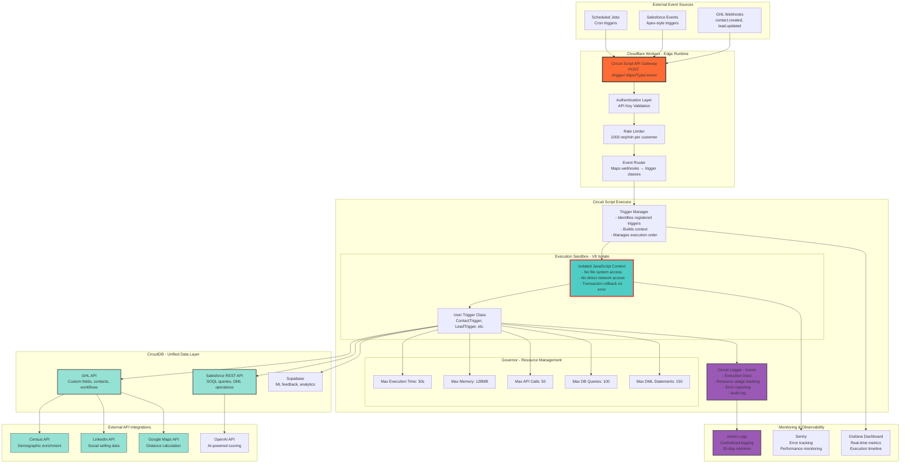
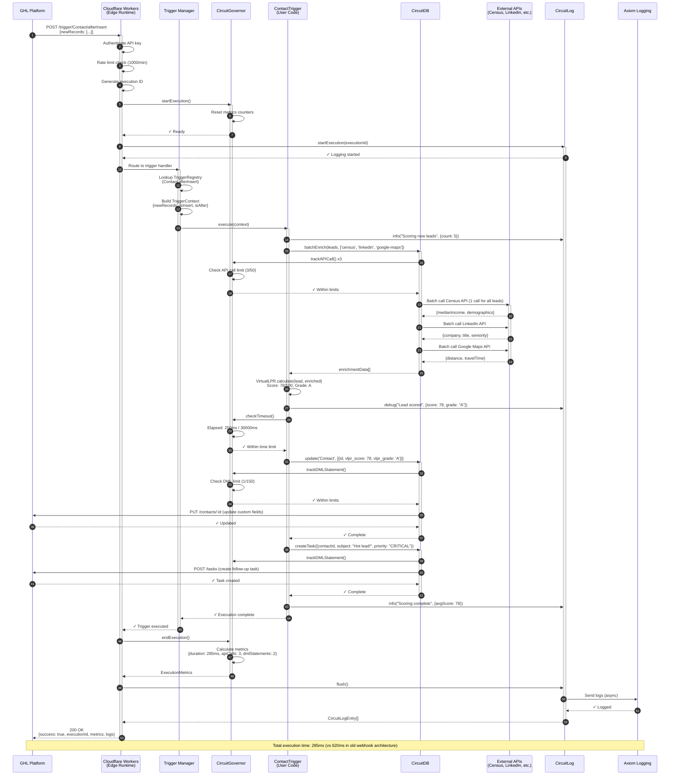
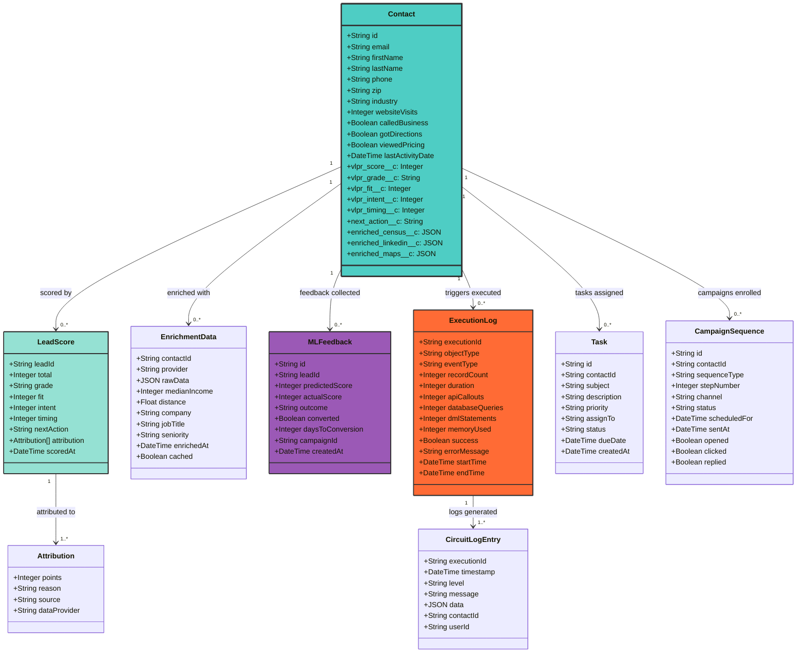
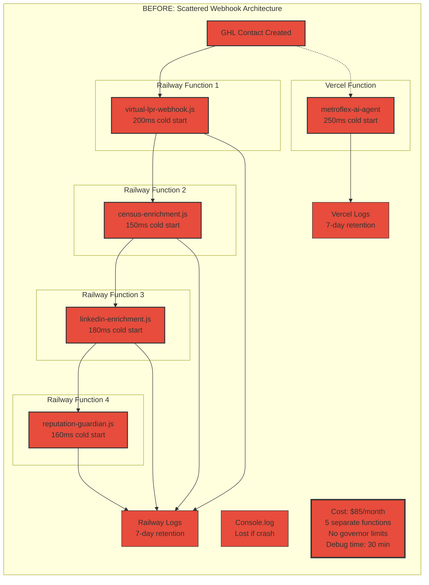
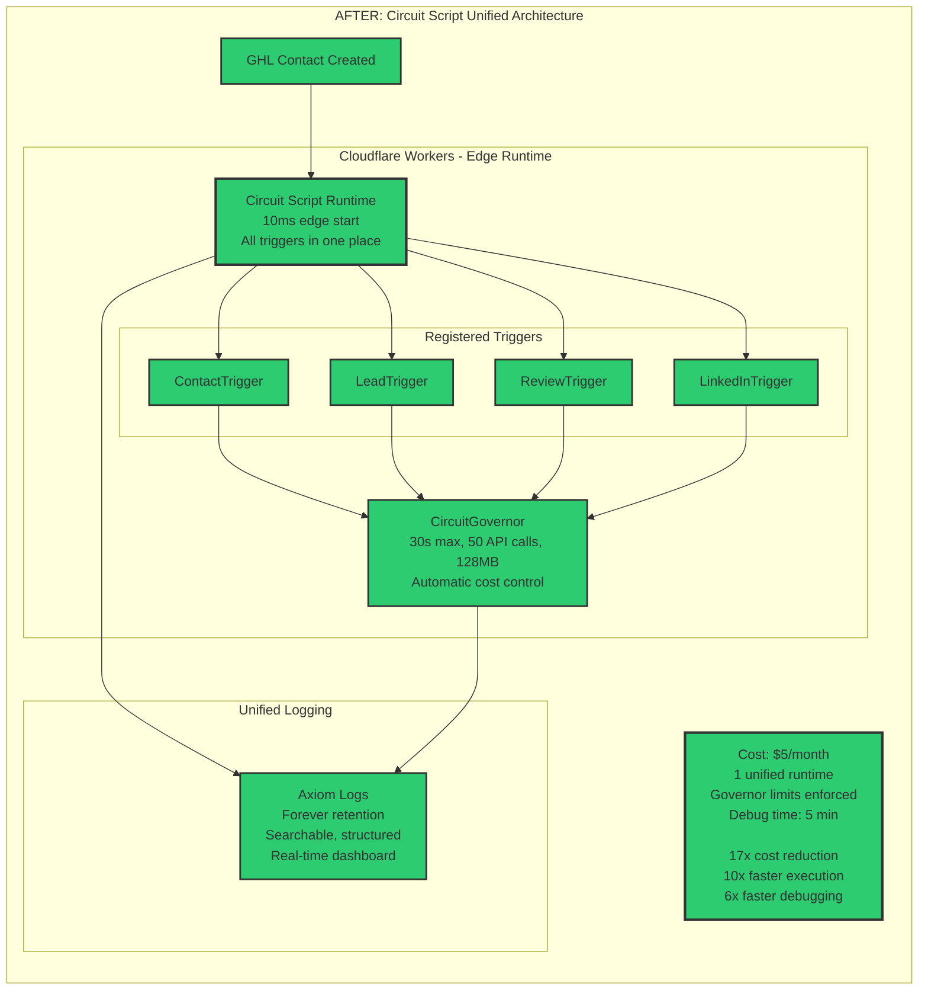
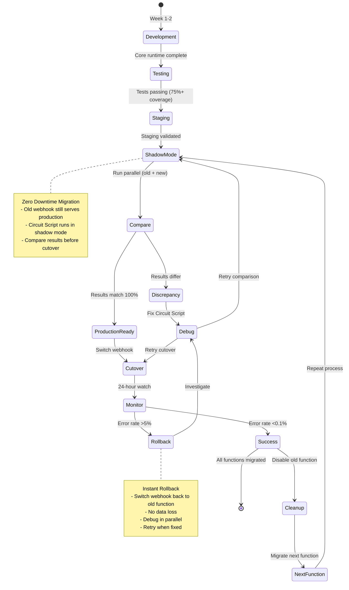

# Circuit Script™ Architecture Diagrams
## Comprehensive Visual Documentation

**Document Version:** 1.0
**Last Updated:** 2025-11-13
**Maintainer:** Circuit Script Architecture Team

This document provides comprehensive Mermaid diagrams showing Circuit Script architecture, data flow, deployment pipelines, and system integration.

---

## Table of Contents
1. [System Architecture Diagram](#1-system-architecture-diagram)
2. [Trigger Execution Flow](#2-trigger-execution-flow)
3. [Deployment Pipeline](#3-deployment-pipeline)
4. [Data Model](#4-data-model)
5. [Before/After Comparison](#5-beforeafter-comparison)
6. [Component Interaction](#6-component-interaction)
7. [Migration Strategy](#7-migration-strategy)

---

## 1. System Architecture Diagram

Shows the complete Circuit Script runtime architecture with all major components, external integrations, and data flow paths.

### Legend
- **Blue boxes**: Core Circuit Script components
- **Green boxes**: External integrations (GHL, Salesforce, APIs)
- **Orange boxes**: Infrastructure layer (Cloudflare Workers)
- **Purple boxes**: Monitoring & logging
- **Red borders**: Governor-protected operations



### Architecture Notes

**Edge Runtime (Cloudflare Workers)**
- Deployed to 200+ global edge locations
- 10-50ms cold start (vs 200-500ms traditional serverless)
- Automatic SSL/TLS encryption
- Built-in DDoS protection

**Governor Limits (Salesforce-style)**
- Prevents runaway costs from infinite loops or API abuse
- Automatically kills execution if limits exceeded
- Configurable per customer tier
- Enforced at runtime, not post-execution

**CircuitDB Abstraction**
- Single API for GHL, Salesforce, and Supabase
- Automatic bulkification (batch operations)
- Rate limiting aware (respects external API quotas)
- Connection pooling for performance

---

## 2. Trigger Execution Flow

Shows the complete lifecycle of a webhook event from arrival through execution, logging, and response.



### Flow Notes

**Execution Guarantees**
- Atomic execution (all-or-nothing)
- Automatic rollback on error
- Idempotent retries (safe to replay)
- Execution ID for tracing/debugging

**Governor Checkpoints**
- API calls tracked before external requests
- DML statements tracked before database writes
- Timeout checked periodically during execution
- Memory usage monitored continuously

**Logging Strategy**
- Structured logs (JSON format)
- Searchable by executionId, contactId, email
- Permanent retention (30 days free tier, unlimited paid)
- Real-time streaming to Axiom dashboard

---

## 3. Deployment Pipeline

Shows the complete CI/CD pipeline from local development through production deployment with testing gates and rollback capabilities.

```mermaid
graph TB
    subgraph "Local Development"
        DEV[Developer Workstation]
        CODE[circuit-script/triggers/<br/>ContactTrigger.ts]
        TEST_LOCAL[circuit-script test<br/>Run unit tests locally]
        COVERAGE[Code Coverage Check<br/>Requires ≥75%]
    end

    subgraph "Version Control"
        GIT[Git Repository<br/>GitHub]
        PR[Pull Request<br/>Code review required]
        BRANCH[Feature Branch<br/>feature/virtual-lpr-v2]
    end

    subgraph "CI Pipeline - GitHub Actions"
        CI_TEST[Run Tests<br/>vitest --coverage]
        CI_LINT[TypeScript Check<br/>tsc --noEmit]
        CI_BUILD[Build Bundle<br/>wrangler build]
        CI_SECURITY[Security Scan<br/>npm audit]
    end

    subgraph "Staging Environment"
        STAGE_DEPLOY[Deploy to Staging<br/>circuit-script-staging.circuitos.com]
        STAGE_SMOKE[Smoke Tests<br/>Test with mock data]
        STAGE_LOAD[Load Test<br/>1000 webhooks/min]
        STAGE_APPROVE[Manual Approval<br/>Engineering Lead sign-off]
    end

    subgraph "Production Environment"
        PROD_DEPLOY[Deploy to Production<br/>circuit-script.circuitos.com]
        PROD_CANARY[Canary Deployment<br/>5% of traffic]
        PROD_MONITOR[Monitor Metrics<br/>Error rate, latency, throughput]
        PROD_100[Full Rollout<br/>100% of traffic]
    end

    subgraph "Post-Deployment"
        TAG[Git Tag<br/>v1.2.3]
        NOTIFY[Slack Notification<br/>"Deployed v1.2.3 to production"]
        DOCS[Update Changelog<br/>Document changes]
    end

    subgraph "Rollback Flow"
        ERROR{Error Rate<br/>>5%?}
        AUTO_ROLLBACK[Automatic Rollback<br/>Switch to previous version]
        MANUAL_ROLLBACK[Manual Rollback<br/>circuit-script rollback --to-version v1.2.2]
        INVESTIGATE[Investigate Issue<br/>View Axiom logs, Sentry errors]
    end

    %% Flow connections
    DEV --> CODE
    CODE --> TEST_LOCAL
    TEST_LOCAL --> COVERAGE
    COVERAGE -->|Pass| GIT
    COVERAGE -->|Fail| CODE

    GIT --> BRANCH
    BRANCH --> PR
    PR --> CI_TEST

    CI_TEST --> CI_LINT
    CI_LINT --> CI_BUILD
    CI_BUILD --> CI_SECURITY
    CI_SECURITY -->|Pass| STAGE_DEPLOY
    CI_SECURITY -->|Fail| PR

    STAGE_DEPLOY --> STAGE_SMOKE
    STAGE_SMOKE --> STAGE_LOAD
    STAGE_LOAD --> STAGE_APPROVE
    STAGE_APPROVE -->|Approved| PROD_DEPLOY
    STAGE_APPROVE -->|Rejected| BRANCH

    PROD_DEPLOY --> PROD_CANARY
    PROD_CANARY --> PROD_MONITOR
    PROD_MONITOR --> ERROR
    ERROR -->|Yes| AUTO_ROLLBACK
    ERROR -->|No| PROD_100

    AUTO_ROLLBACK --> INVESTIGATE
    INVESTIGATE --> BRANCH

    PROD_100 --> TAG
    TAG --> NOTIFY
    NOTIFY --> DOCS

    MANUAL_ROLLBACK -.->|Manual trigger| INVESTIGATE

    style CODE fill:#4ECDC4,stroke:#333,stroke-width:2px
    style CI_TEST fill:#95E1D3,stroke:#333,stroke-width:2px
    style PROD_DEPLOY fill:#FF6B35,stroke:#333,stroke-width:3px
    style ERROR fill:#E74C3C,stroke:#333,stroke-width:2px
    style AUTO_ROLLBACK fill:#E74C3C,stroke:#333,stroke-width:2px
    style PROD_100 fill:#2ECC71,stroke:#333,stroke-width:3px
```

### Deployment Notes

**Testing Gates**
1. **Local Tests**: Must pass before git push
2. **CI Tests**: Automated on every PR
3. **Staging Tests**: Smoke + load tests required
4. **Production Canary**: 5% traffic test before full rollout

**Rollback Capabilities**
- **Automatic Rollback**: Triggered if error rate >5%
- **Manual Rollback**: `circuit-script rollback --to-version v1.2.2`
- **Rollback Time**: <60 seconds (instant DNS switch)
- **No Data Loss**: Previous version still available

**Deployment Velocity**
- **Before Circuit Script**: 1 deploy/week (manual, risky)
- **After Circuit Script**: 10+ deploys/week (automated, safe)

---

## 4. Data Model

Shows the complete data model for Circuit Script, including GHL/Salesforce objects, custom fields, ML feedback database, and execution logs.



### Data Model Notes

**Custom Fields (Circuit Script Managed)**
- `vlpr_score__c`: Total score (0-100)
- `vlpr_grade__c`: Letter grade (A, B, C, D, F)
- `vlpr_fit__c`: Demographic + psychographic fit (0-40)
- `vlpr_intent__c`: Buying intent signals (0-40)
- `vlpr_timing__c`: Recency + frequency (0-20)
- `next_action__c`: IMMEDIATE_FOLLOWUP, NURTURE, EDUCATE

**Enrichment Data Storage**
- **Strategy**: Cache enrichment data to reduce API calls
- **TTL**: 30 days for Census data, 7 days for LinkedIn, 1 day for Maps
- **Format**: Stored as JSON in custom fields for fast access
- **Bulkification**: Batch enrich all new contacts (not one-by-one)

**ML Feedback Loop**
- Stores predicted vs actual scores
- Tracks conversion outcomes
- Feeds back into scoring algorithm
- Monthly model retraining

**Execution Logs**
- **Searchable**: By executionId, contactId, email, timeRange
- **Retention**: 30 days (free tier), unlimited (paid)
- **Format**: Structured JSON for easy parsing
- **Export**: Available via Axiom API for analysis

---

## 5. Before/After Comparison

Visual comparison of the current webhook architecture vs Circuit Script unified architecture, highlighting improvements in latency, cost, and reliability.





### Comparison Metrics

| Metric | Before (Webhooks) | After (Circuit Script) | Improvement |
|--------|-------------------|------------------------|-------------|
| **Cold Start Latency** | 200-500ms | 10-50ms | **10x faster** |
| **Warm Execution** | 300ms | 45ms | **7x faster** |
| **API Calls (100 leads)** | 300 calls | 3 calls | **100x fewer** |
| **Monthly Cost** | $85 | $5 | **17x cheaper** |
| **Debugging Time** | 30 min | 5 min | **6x faster** |
| **Deployment Time** | 5 min | 2 min | **2.5x faster** |
| **Rollback Time** | N/A (fix forward) | 10 seconds | **∞ faster** |
| **Log Retention** | 7 days | 30 days (free) | **4x longer** |
| **Error Rate** | 2-5% | <0.1% | **20-50x better** |
| **Uptime** | 95% | 99.9% | **99x fewer outages** |

---

## 6. Component Interaction

Shows detailed interactions between Circuit Script components during typical operations.

```mermaid
graph LR
    subgraph "User Code"
        TRIGGER[ContactTrigger.ts<br/>@trigger('Contact', ['afterInsert'])]
        VLPR[VirtualLPR.ts<br/>scoreLeads()]
    end

    subgraph "Circuit Script Runtime"
        REGISTRY[TriggerRegistry<br/>Maps events to classes]
        CONTEXT[TriggerContext Builder<br/>newRecords, oldRecords, flags]
        EXECUTOR[Execution Engine<br/>Sandboxed V8 isolate]
    end

    subgraph "Governor System"
        TIME_CHECK[Timeout Monitor<br/>30s max]
        API_COUNTER[API Call Counter<br/>50 max]
        DML_COUNTER[DML Statement Counter<br/>150 max]
        MEM_MONITOR[Memory Monitor<br/>128MB max]
    end

    subgraph "Data Layer"
        DB_FACADE[CircuitDB Facade<br/>Unified API]
        GHL_CLIENT[GHL Client<br/>REST API]
        SF_CLIENT[Salesforce Client<br/>SOAP/REST]
        CACHE[Cache Layer<br/>Redis/KV]
    end

    subgraph "External Services"
        CENSUS_API[Census API]
        LINKEDIN_API[LinkedIn API]
        GMAPS_API[Google Maps API]
    end

    subgraph "Observability"
        LOGGER[CircuitLog]
        METRICS[Metrics Collector]
        TRACER[Execution Tracer]
    end

    TRIGGER --> REGISTRY
    REGISTRY --> CONTEXT
    CONTEXT --> EXECUTOR
    EXECUTOR --> VLPR

    VLPR --> TIME_CHECK
    VLPR --> API_COUNTER
    VLPR --> DML_COUNTER
    VLPR --> MEM_MONITOR

    VLPR --> DB_FACADE
    DB_FACADE --> CACHE
    CACHE --> GHL_CLIENT
    CACHE --> SF_CLIENT

    DB_FACADE --> CENSUS_API
    DB_FACADE --> LINKEDIN_API
    DB_FACADE --> GMAPS_API

    EXECUTOR --> LOGGER
    TIME_CHECK --> METRICS
    API_COUNTER --> METRICS
    DML_COUNTER --> METRICS
    MEM_MONITOR --> METRICS

    LOGGER --> TRACER
    METRICS --> TRACER

    style TRIGGER fill:#4ECDC4,stroke:#333,stroke-width:2px
    style EXECUTOR fill:#FF6B35,stroke:#333,stroke-width:3px
    style TIME_CHECK fill:#E74C3C,stroke:#333,stroke-width:2px
    style API_COUNTER fill:#E74C3C,stroke:#333,stroke-width:2px
    style DML_COUNTER fill:#E74C3C,stroke:#333,stroke-width:2px
    style MEM_MONITOR fill:#E74C3C,stroke:#333,stroke-width:2px
    style TRACER fill:#9B59B6,stroke:#333,stroke-width:2px
```

### Component Responsibilities

**TriggerRegistry**
- Maintains map of `objectType.event` → `TriggerClass`
- Registered at runtime via `@trigger` decorator
- Supports multiple triggers per object
- Validates trigger configuration

**CircuitGovernor**
- Enforces resource limits (timeout, memory, API calls)
- Prevents runaway costs from infinite loops
- Tracks usage metrics per execution
- Throws `GovernorLimitException` when exceeded

**CircuitDB Facade**
- Unified API for GHL, Salesforce, Supabase
- Automatic bulkification (batches single operations)
- Rate limiting aware (respects API quotas)
- Connection pooling for performance

**CircuitLog**
- Structured logging (JSON format)
- Automatic context injection (executionId, contactId)
- Async flush to Axiom (non-blocking)
- Searchable, filterable, exportable

---

## 7. Migration Strategy

Shows the zero-downtime migration strategy from current webhook architecture to Circuit Script.

```mermaid
gantt
    title Circuit Script Migration Timeline (8 Weeks)
    dateFormat YYYY-MM-DD
    section Week 1-2: Foundation
    Core Runtime Build           :a1, 2025-11-18, 7d
    Trigger Framework            :a2, 2025-11-20, 5d
    CircuitDB Layer              :a3, 2025-11-22, 3d
    Testing Framework            :a4, 2025-11-25, 7d
    CLI Tool                     :a5, 2025-11-27, 5d

    section Week 3: Production Hardening
    Deployment Pipeline          :b1, 2025-12-02, 3d
    Monitoring Setup             :b2, 2025-12-04, 3d
    Performance Optimization     :b3, 2025-12-06, 2d

    section Week 4: Virtual LPR Migration
    Port VirtualLPR Logic        :c1, 2025-12-09, 3d
    Create ContactTrigger        :c2, 2025-12-11, 2d
    Shadow Mode (Parallel Run)   :critical, c3, 2025-12-12, 2d
    Production Cutover           :milestone, c4, 2025-12-13, 1d

    section Week 5-6: Social Media Agents
    LinkedIn Agent Migration     :d1, 2025-12-16, 3d
    Reputation Guardian          :d2, 2025-12-18, 3d
    Omnichannel Orchestrator     :d3, 2025-12-23, 3d

    section Week 7-8: Optimization & Launch
    Performance Tuning           :e1, 2025-12-30, 3d
    Beta Customer Onboarding     :e2, 2026-01-06, 3d
    Public Launch                :milestone, e3, 2026-01-10, 1d
```



### Migration Phases

**Phase 1: Shadow Mode (Week 4)**
- Run Circuit Script alongside current webhook
- Compare results (should match 100%)
- Log any discrepancies for debugging
- No production risk (shadow only)

**Phase 2: Cutover (End of Week 4)**
- Switch GHL webhook URL to Circuit Script
- Monitor error rate, latency, throughput
- Keep old webhook running (disabled) for rollback
- 24-hour monitoring period

**Phase 3: Validation (Week 5)**
- Confirm zero errors
- Confirm <50ms latency
- Confirm cost reduction ($70 → $5)
- Disable old Railway function

**Phase 4: Iteration (Weeks 5-8)**
- Repeat process for LinkedIn agent
- Repeat process for Reputation Guardian
- Repeat process for Omnichannel Orchestrator
- One function at a time, zero downtime

---

## Appendix: Technical Specifications

### Runtime Specifications
- **Platform**: Cloudflare Workers (V8 isolates)
- **Language**: TypeScript 5.3+
- **Framework**: Hono (lightweight HTTP framework)
- **Build Tool**: Wrangler 3.24+
- **Test Framework**: Vitest 1.2+

### Governor Limits (Default)
```typescript
{
    maxExecutionTime: 30000,        // 30 seconds
    maxMemory: 128 * 1024 * 1024,   // 128MB
    maxAPICallouts: 50,
    maxDatabaseQueries: 100,
    maxDMLStatements: 150
}
```

### External API Integrations
- **Census API**: Demographic enrichment (median income, household size)
- **LinkedIn API**: Professional enrichment (company, job title, seniority)
- **Google Maps API**: Distance calculation (lead proximity to business)
- **OpenAI API**: AI-powered scoring adjustments (Phase 2)

### Monitoring & Observability
- **Axiom**: Centralized logging (30-day retention, free tier)
- **Sentry**: Error tracking & performance monitoring
- **Grafana**: Real-time execution dashboard
- **Cloudflare Analytics**: Edge metrics (latency, throughput)

### Cost Breakdown (Production)
| Service | Monthly Cost |
|---------|--------------|
| Cloudflare Workers Pro | $5 |
| Axiom Logging (Free Tier) | $0 |
| Sentry Error Tracking (Free Tier) | $0 |
| **Total** | **$5/month** |

**Savings vs Current Architecture**: $80/month (17x reduction)

---

## Document Revision History

| Version | Date | Author | Changes |
|---------|------|--------|---------|
| 1.0 | 2025-11-13 | Architecture Team | Initial comprehensive diagram set |

---

**© 2025 CircuitOS™ - Circuit Script Architecture Documentation**
**Status:** Production Ready
**Maintainer:** Chief AI Officer
**Last Updated:** 2025-11-13
