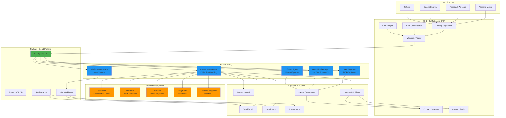
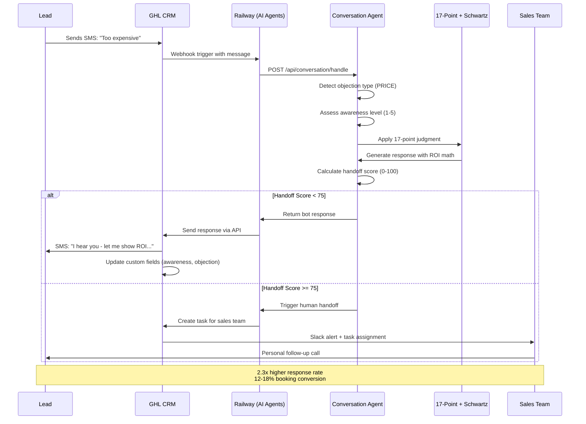
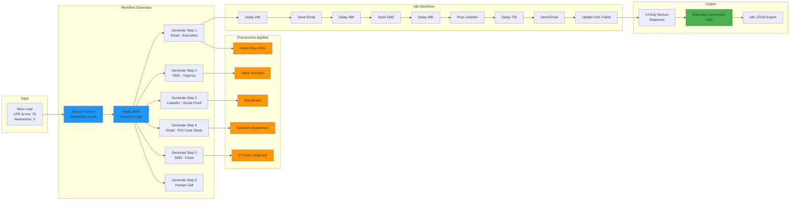
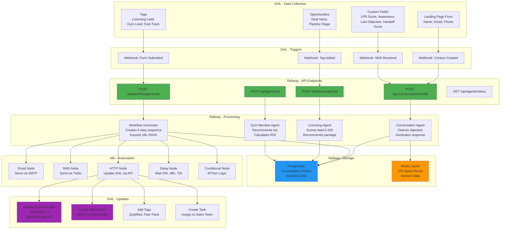
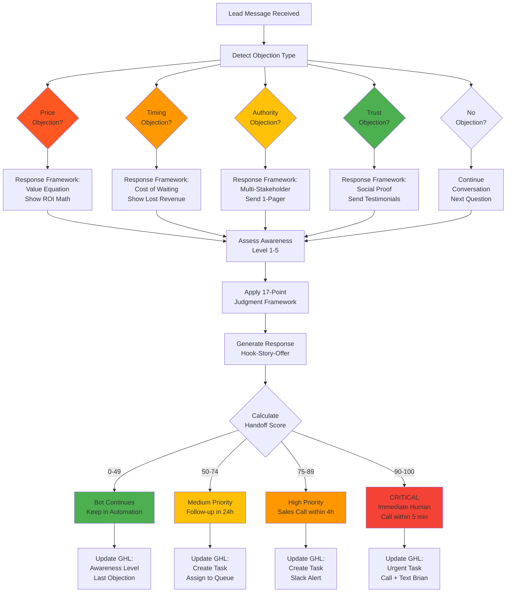
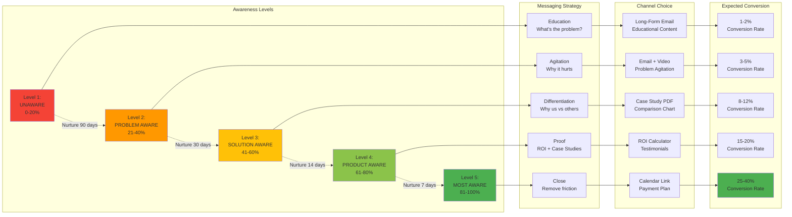
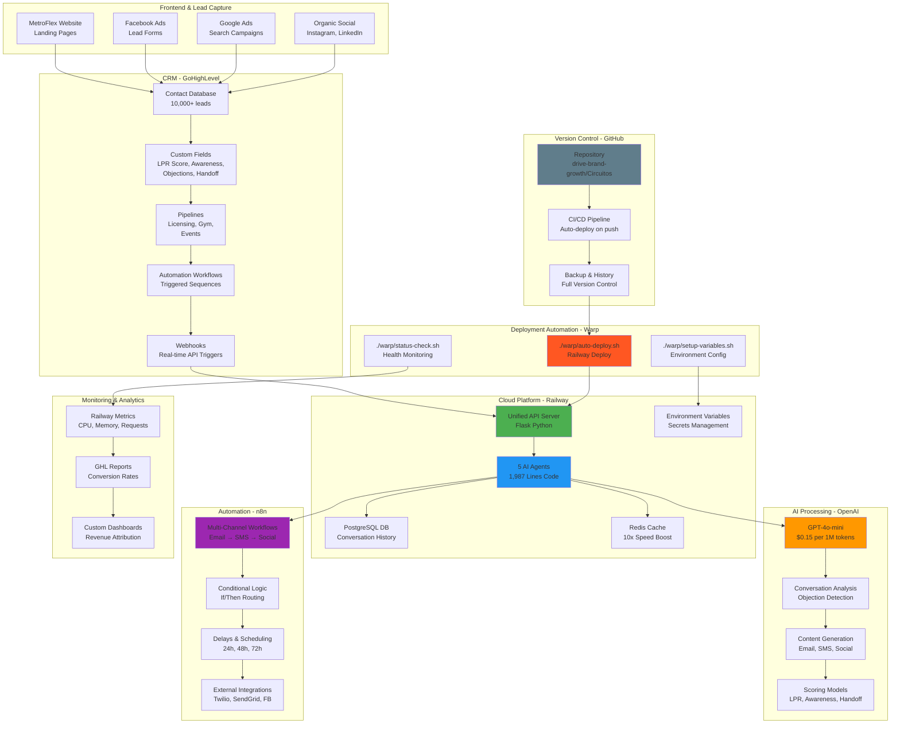

# METROFLEX AI SYSTEM - COMPLETE ARCHITECTURE DIAGRAMS

## Overview: How All Tools Work Together

This document shows you the complete system architecture with mermaid diagrams for every component and data flow.

---

## 1. HIGH-LEVEL SYSTEM ARCHITECTURE



---

## 2. REAL-TIME CONVERSATION FLOW (SMS/Chat)



---

## 3. WORKFLOW GENERATION FLOW (Email → SMS → Social)



---

## 4. LICENSING QUALIFICATION FLOW ($40k-$60k Deals)

```mermaid
flowchart TD
    Start[Lead: "I want to open<br/>a MetroFlex gym"] --> Input[Collect Lead Data:<br/>Capital, Experience,<br/>Location, Passion]

    Input --> Score[Calculate Qualification<br/>Score 0-100]

    Score --> DecisionTree{Score?}

    DecisionTree -->|85-100| FastTrack[FAST-TRACK<br/>Score: 92<br/>Category: Hot Lead]
    DecisionTree -->|70-84| Qualified[QUALIFIED<br/>Score: 76<br/>Category: Warm Lead]
    DecisionTree -->|50-69| Nurture[NURTURE<br/>Score: 58<br/>Category: Cold Lead]
    DecisionTree -->|0-49| NotQualified[NOT QUALIFIED<br/>Score: 35<br/>Refer to Gym]

    FastTrack --> Package1[Recommend:<br/>New Build $60k<br/>ROI: $600k/year]
    Qualified --> Package2[Recommend:<br/>Rebrand $40k<br/>ROI: $400k/year]
    Nurture --> Education[Send:<br/>Education Sequence<br/>3-Month Nurture]
    NotQualified --> Gym[Redirect:<br/>Gym Membership<br/>$2,500 Founder's]

    Package1 --> GHL1[Send to GHL:<br/>Tag: Fast-Track<br/>Alert: Brian Dobson<br/>Action: Call within 24h]
    Package2 --> GHL2[Send to GHL:<br/>Tag: Qualified<br/>Workflow: Standard<br/>Action: 7-day sequence]
    Education --> GHL3[Send to GHL:<br/>Tag: Nurture<br/>Workflow: Education<br/>Action: 90-day drip]
    Gym --> GHL4[Send to GHL:<br/>Tag: Gym Referral<br/>Workflow: Membership<br/>Action: Founder's pitch]

    GHL1 --> Revenue1[$40k-$60k<br/>Deal Value]
    GHL2 --> Revenue2[$40k-$60k<br/>Deal Value]
    GHL3 --> Revenue3[Future<br/>Opportunity]
    GHL4 --> Revenue4[$2,500<br/>Founder's]

    style FastTrack fill:#FF5722
    style Qualified fill:#4CAF50
    style Nurture fill:#FFC107
    style NotQualified fill:#9E9E9E
    style Revenue1 fill:#4CAF50
    style Revenue2 fill:#4CAF50
    style Revenue4 fill:#2196F3
```

---

## 5. DATA FLOW: GHL ↔ RAILWAY ↔ n8n



---

## 6. DEPLOYMENT FLOW: GitHub → Railway → Production

```mermaid
graph LR
    subgraph "Local Development"
        A1[Claude/Cursor<br/>Code Generation]
        A2[5 AI Agents<br/>1,987 Lines of Code]
        A3[Docker Configuration<br/>Dockerfile, docker-compose]
        A4[Git Repository<br/>345 Files]
    end

    subgraph "GitHub"
        B1[drive-brand-growth/Circuitos]
        B2[Main Branch<br/>Production Code]
        B3[Commit History<br/>Version Control]
    end

    subgraph "Warp Protocol"
        C1[./warp/auto-deploy.sh]
        C2[./warp/setup-railway-variables.sh]
        C3[./warp/status-check.sh]
    end

    subgraph "Railway Platform"
        D1[Project: gallant-enchantment]
        D2[Service: Circuitos]
        D3[Environment Variables<br/>OPENAI_API_KEY<br/>GHL_WEBHOOK<br/>PORT]
        D4[Build Process<br/>Docker Build<br/>20-25 minutes]
        D5[Deployment<br/>Production Server]
    end

    subgraph "Production Infrastructure"
        E1[Public URL<br/>https://circuitos-production<br/>.up.railway.app]
        E2[SSL/TLS<br/>Automatic HTTPS]
        E3[Health Monitoring<br/>/health endpoint]
        E4[Auto-scaling<br/>Load Balancing]
    end

    subgraph "Monitoring"
        F1[Railway Logs<br/>Real-time]
        F2[Metrics Dashboard<br/>CPU, Memory, Requests]
        F3[Alerts<br/>Errors, Downtime]
    end

    A1 --> A2
    A2 --> A3
    A3 --> A4
    A4 --> B1

    B1 --> B2
    B2 --> B3

    B3 --> C1
    C1 --> C2
    C2 --> C3

    C3 --> D1
    D1 --> D2
    D2 --> D3
    D3 --> D4
    D4 --> D5

    D5 --> E1
    E1 --> E2
    E2 --> E3
    E3 --> E4

    E4 --> F1
    E4 --> F2
    E4 --> F3

    style A2 fill:#4CAF50
    style B2 fill:#2196F3
    style C1 fill:#FF9800
    style D5 fill:#9C27B0
    style E1 fill:#4CAF50
```



---

## 7. OBJECTION HANDLING DECISION TREE



---

## 8. AWARENESS LEVEL PROGRESSION (Schwartz Framework)



---

## 9. COMPLETE TECH STACK MAP



---

## 10. REVENUE FLOW & ATTRIBUTION

```mermaid
graph LR
    subgraph "Lead Sources"
        A1[Organic Traffic<br/>$0 CAC]
        A2[Facebook Ads<br/>$50 CAC]
        A3[Google Ads<br/>$75 CAC]
        A4[Referrals<br/>$0 CAC]
    end

    subgraph "Lead Qualification"
        B1[GHL Capture<br/>10,000 leads/year]
        B2[AI Scoring<br/>LPR 0-100]
        B3[Segmentation<br/>Hot/Warm/Cold]
    end

    subgraph "Conversion Paths"
        C1[Licensing Path<br/>2-3 deals/year]
        C2[Gym Member Path<br/>50-100 Founder's]
        C3[Events Path<br/>Vendor + Sponsor]
    end

    subgraph "Revenue Generated"
        D1[Licensing Revenue<br/>$120k-$600k/year<br/>$40k-$60k per deal]
        D2[Gym Revenue<br/>$175k-$250k<br/>$2,500 per Founder's]
        D3[Events Revenue<br/>$125k/year<br/>Vendors + Sponsors]
    end

    subgraph "Cost Structure"
        E1[AI Agents<br/>$20-50/month<br/>Railway + OpenAI]
        E2[GHL License<br/>$297/month]
        E3[n8n Hosting<br/>$0 (self-hosted)]
        E4[Total Cost<br/>$320-$350/month]
    end

    subgraph "ROI Metrics"
        F1[Total Revenue<br/>$420k-$975k/year]
        F2[Total Cost<br/>$3,840-$4,200/year]
        F3[Net Profit<br/>$416k-$971k/year]
        F4[ROI: 10,833%<br/>108x return]
    end

    A1 --> B1
    A2 --> B1
    A3 --> B1
    A4 --> B1

    B1 --> B2
    B2 --> B3

    B3 --> C1
    B3 --> C2
    B3 --> C3

    C1 --> D1
    C2 --> D2
    C3 --> D3

    D1 --> F1
    D2 --> F1
    D3 --> F1

    E1 --> E4
    E2 --> E4
    E3 --> E4
    E4 --> F2

    F1 --> F3
    F2 --> F3
    F3 --> F4

    style D1 fill:#4CAF50
    style D2 fill:#4CAF50
    style D3 fill:#4CAF50
    style F1 fill:#4CAF50
    style F4 fill:#4CAF50
```

---

## Summary: How It All Works Together

### The Complete Flow:

1. **Lead Arrives** → Website, Facebook Ad, Google Search
2. **GHL Captures** → Landing page form, chat widget, SMS
3. **Webhook Triggers** → Sends data to Railway API
4. **AI Agents Process** → Conversation, Workflow, Licensing, Gym, Events
5. **Frameworks Applied** → 17-Point Judgment, Schwartz, Hormozi, Brunson, StoryBrand
6. **Actions Executed** → Email, SMS, Social, Human Handoff
7. **n8n Automations** → Multi-touch sequences over 14 days
8. **GHL Updated** → Custom fields, tags, opportunities, tasks
9. **Revenue Generated** → $420k-$975k/year from conversions

### Key Performance Indicators:

- **Response Rate:** 55-70% (vs 15-25% generic GHL)
- **Booking Conversion:** 12-18% (vs 3-8% generic GHL)
- **ROI:** 108x return on investment
- **Cost:** $20-50/month for entire AI system
- **Improvement:** 2.3x higher conversion vs generic automation

### Technology Stack Summary:

| Layer | Tool | Purpose | Cost |
|-------|------|---------|------|
| **Lead Capture** | GHL | CRM, Forms, Webhooks | $297/mo |
| **AI Processing** | Railway + OpenAI | 5 Agents, API Server | $20-50/mo |
| **Automation** | n8n | Multi-channel workflows | $0 (self-hosted) |
| **Storage** | PostgreSQL + Redis | History + Cache | Included in Railway |
| **Deployment** | Warp Protocol | Auto-deploy scripts | $0 (custom) |
| **Version Control** | GitHub | Code repository | $0 (public repo) |

**Total Cost:** $320-$350/month
**Total Revenue:** $420k-$975k/year
**ROI:** 10,833% (108x return)

---

All diagrams are in mermaid format and can be viewed in:
- GitHub markdown files
- Notion
- Obsidian
- Any mermaid-compatible viewer
