# METROFLEX EVENTS AI AGENT - WORKFLOW DIAGRAMS

## 🎨 MERMAID DIAGRAMS

### **DIAGRAM 1: COMPLETE SYSTEM ARCHITECTURE**


---

### **DIAGRAM 2: DETAILED n8n WORKFLOW**


---

### **DIAGRAM 3: ATHLETE JOURNEY FLOW**


---

### **DIAGRAM 4: DATA FLOW & TRANSFORMATION**

```mermaid
graph LR
    subgraph "Stage 1: Raw Data"
        RAW[Instagram Profile<br/>Raw JSON from Apify]
    end

    subgraph "Stage 2: Cleaned Data"
        CLEAN[Cleaned Profile<br/>username: johnsmith_fitness<br/>followers: 5200<br/>bio: IFBB Pro Dallas TX<br/>posts: 847]
    end

    subgraph "Stage 3: AI Enrichment"
        ENRICH[AI-Enriched Profile<br/>isNPCCompetitor: true<br/>division: Men's Physique<br/>experienceLevel: Advanced<br/>location: Dallas, TX<br/>recruitmentPotential: 85<br/>personalizedMessage: Hey John...]
    end

    subgraph "Stage 4: GHL Format"
        GHL_DATA[GHL Contact<br/>firstName: John<br/>lastName: Smith<br/>customFields:<br/>  instagram_username<br/>  division<br/>  recruitment_score<br/>tags: NPC_Competitor,<br/>  Priority_High,<br/>  Location_Dallas]
    end

    subgraph "Stage 5: Campaign Data"
        CAMPAIGN[Campaign Variables<br/>{{ firstName }} = John<br/>{{ personalizedMessage }}<br/>{{ registrationLink }}<br/>{{ earlyBirdDiscount }}]
    end

    RAW -->|n8n Parse Node| CLEAN
    CLEAN -->|n8n + Claude API| ENRICH
    ENRICH -->|n8n Format Node| GHL_DATA
    GHL_DATA -->|GHL Workflow| CAMPAIGN

    style RAW fill:#ff9a9e,stroke:#333,stroke-width:2px
    style CLEAN fill:#fad0c4,stroke:#333,stroke-width:2px
    style ENRICH fill:#ffecd2,stroke:#333,stroke-width:2px
    style GHL_DATA fill:#a1c4fd,stroke:#333,stroke-width:2px
    style CAMPAIGN fill:#c2e9fb,stroke:#333,stroke-width:2px
```

---

### **DIAGRAM 5: COST vs VOLUME SCALING**


---

### **DIAGRAM 6: DECISION TREE - ATHLETE QUALIFICATION**


---

### **DIAGRAM 7: COMPETITOR INTELLIGENCE WORKFLOW**


---

### **DIAGRAM 8: SYSTEM MONITORING DASHBOARD**

```mermaid
graph TB
    subgraph "Real-Time Metrics"
        M1[Profiles Scraped Today: 127]
        M2[Qualified Athletes: 38]
        M3[Added to GHL: 38]
        M4[Campaigns Triggered: 38]
    end

    subgraph "Weekly Performance"
        W1[Total Scraped: 489]
        W2[Qualification Rate: 37%]
        W3[Email Open Rate: 42%]
        W4[Click Rate: 18%]
        W5[Registration Rate: 3.2%]
    end

    subgraph "Cost Tracking"
        C1[n8n: $20/mo<br/>92% under limit]
        C2[Apify: $49/mo<br/>4,200/10,000 credits]
        C3[Claude: $18.43/mo<br/>2,147 profiles analyzed]
        C4[Total: $87.43/mo]
    end

    subgraph "ROI Metrics"
        R1[Athletes Registered: 16]
        R2[Revenue Generated: $1,920]
        R3[Cost Per Acquisition: $5.46]
        R4[ROI: 2,096%]
    end

    subgraph "Alerts"
        A1[⚠️ Competitor dropped<br/>prices by $20]
        A2[✅ All systems operational]
        A3[🎯 15 high-potential<br/>athletes this week]
    end

    M1 --> W1
    M2 --> W2
    W3 --> R1
    R1 --> R2
    C4 --> R3
    R2 --> R4

    style M1 fill:#00b894,stroke:#333,stroke-width:2px,color:#fff
    style M2 fill:#00b894,stroke:#333,stroke-width:2px,color:#fff
    style W2 fill:#fdcb6e,stroke:#333,stroke-width:2px
    style W3 fill:#fdcb6e,stroke:#333,stroke-width:2px
    style R4 fill:#55efc4,stroke:#333,stroke-width:3px,color:#333
    style A1 fill:#ff7675,stroke:#333,stroke-width:2px,color:#fff
    style A2 fill:#00b894,stroke:#333,stroke-width:2px,color:#fff
    style A3 fill:#74b9ff,stroke:#333,stroke-width:2px,color:#fff
```



---

## 📊 DIAGRAM USAGE GUIDE

### **How to Use These Diagrams:**

1. **Diagram 1 - System Architecture**: Show to stakeholders for high-level overview
2. **Diagram 2 - n8n Workflow**: Technical reference for building/debugging
3. **Diagram 3 - Athlete Journey**: Understand user experience, optimize touchpoints
4. **Diagram 4 - Data Flow**: Understand data transformations at each stage
5. **Diagram 5 - Scaling**: Plan budget as you grow
6. **Diagram 6 - Decision Tree**: Understand AI qualification logic
7. **Diagram 7 - Competitor Intelligence**: Advanced feature for Phase 2
8. **Diagram 8 - Monitoring**: Build dashboard to track performance

### **Viewing Diagrams:**

These Mermaid diagrams render in:
- ✅ GitHub (native support)
- ✅ GitLab (native support)
- ✅ VS Code (with Mermaid extension)
- ✅ Notion (with /embed)
- ✅ Obsidian (native support)
- ✅ Mermaid Live Editor: https://mermaid.live

### **Exporting Diagrams:**

**As PNG/SVG:**
1. Copy diagram code
2. Go to https://mermaid.live
3. Paste code
4. Click "Export" → PNG or SVG
5. Use in presentations, documentation

**As PDF:**
1. Export as SVG first
2. Open in browser
3. Print to PDF

---

## 🎯 KEY TAKEAWAYS FROM DIAGRAMS

### **From System Architecture (Diagram 1):**
- 4 core tools: Apify → n8n → Claude → GHL
- Data flows one direction (scrape → analyze → store → outreach)
- Multiple revenue streams (athlete registration + ticket sales)
- Cost: $84-119/mo | Revenue: $1,200-2,400/mo

### **From n8n Workflow (Diagram 2):**
- Runs weekly (Sunday 9am)
- Processes 500 profiles in ~30 minutes
- Claude analyzes each profile ($0.01 per athlete)
- 30-40% qualify and go to GHL
- Automatic campaign triggering

### **From Athlete Journey (Diagram 3):**
- Discovery → Outreach → Consideration → Conversion
- Multiple touchpoints needed (email + SMS + DM)
- 40% open rate → 18% click rate → 3% conversion
- Post-registration advocacy (athlete shares & refers)

### **From Scaling (Diagram 5):**
- Start small: 500/mo ($84)
- Scale to 2,000/mo ($134) after 3 months
- Optimize to 5,000/mo ($204) by month 7
- ROI improves as you scale (1,329% → 4,312%)

---

## 📋 IMPLEMENTATION CHECKLIST

Using these diagrams as reference:

### **Phase 1: Setup (Week 1)**
- [ ] Sign up for all 4 tools (n8n, Apify, Claude, GHL)
- [ ] Import n8n workflow JSON
- [ ] Configure Apify Instagram scraper
- [ ] Set up GHL custom fields & tags
- [ ] Test end-to-end with 10 profiles

### **Phase 2: Launch (Week 2)**
- [ ] Schedule Apify scraper (weekly)
- [ ] Activate n8n workflow
- [ ] Monitor first batch (500 profiles)
- [ ] Verify GHL receives data correctly
- [ ] Check campaign triggers

### **Phase 3: Optimize (Weeks 3-4)**
- [ ] Analyze qualification rate (target: 30-40%)
- [ ] Review Claude scoring accuracy
- [ ] Adjust filters if needed
- [ ] Monitor costs vs projections
- [ ] Measure first conversions

### **Phase 4: Scale (Month 2-3)**
- [ ] Increase scraping frequency (bi-weekly)
- [ ] Add more hashtags/data sources
- [ ] Improve email copy based on results
- [ ] Add SMS sequences
- [ ] Consider ManyChat for DMs

**You're ready to build! Use these diagrams as your blueprint. 🚀**
